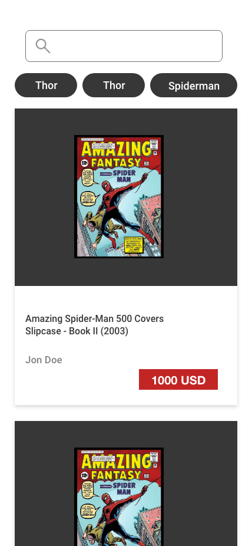

# Ayenda Frontend Test

Welcome to the Ayenda Frontend test. We're so glad to have you here and we are ready to see what you're able to do. 
We invite you to carefully read the next description because it contains the steps and minimun requirements we expect from you.

## Table of Contents

  * [Installation](#installation)
  * [Usage](#usage)
  * [😎 The Challenge](#-the-challenge)
  * [👀 Keep in mind](#-keep-in-mind)
  * [🏁 At the end of the test](#-at-the-end-of-the-test)

## Installation

1. Clone the repo
  ```
    git clone https://github.com/AyendaHoteles/test-frontend-interview.git
  ```
2. Install NPM packages
  ```
    npm install
  ```
  
## Usage

  ```
    npm run dev
  ```

  
## 😎 The Challenge
You will have to build a comic's store using the [Marvel's API](https://developer.marvel.com/docs) taking in count the following points:
  - **UI**: The Comic's store could look like this.(Use it as a guide, but if you have better UI ideas, feel free to include those ones in your solution):

	
    
  - **Show a List of comics**: List the comics that the API returns when you request to the `/v1/public/comics` endpoint.
  - **Include a search field**: When the user type this input field, you should update the comics list based on the user entry.
  - **Filters**: Include a characters filter (This could be just a group of buttons). When user touchs on it, you should show only the comics where this character appears. (Feel free to include any other filter).
  - **Multiplatform**: Your solution should works at least for one Android device and one iOS device.

## 👀 Keep in mind
    
- As we already mentioned, we give you a boilerplate in order to make you the inital setup a little bit easer but feel free to edit or modify what ever you need.
- Feel free to include any approach or tecnology you want
- Pss pss, you could have extra points if you include unit testing in your solution 

## 🏁 At the end of the test

- Please make a pull request with your solution
- **(Optiona)** Share us the APK file to test the app in Android devices
